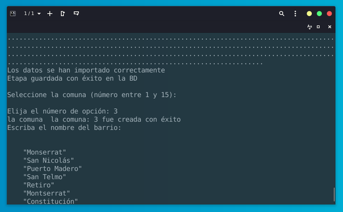
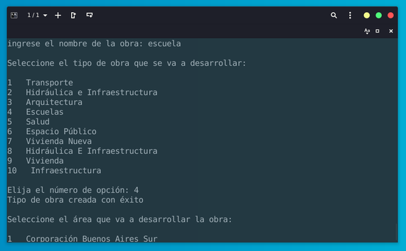

## TP Final OOP

Trabajo práctico final de la materia programación orientada a objetos (IFTS18).

> La consigna puede encontrarse adjunta en PDF.

### Observatorio de obras urbanas

Utilizando un archivo .csv de obras urbanas con información pública generamos una base de datos SQLite desde la clase dao (Data Access Object). El dataset original lo podemos usar [descargándolo](https://cdn.buenosaires.gob.ar/datosabiertos/datasets/secretaria-general-y-relaciones-internacionales/ba-obras/observatorio-de-obras-urbanas.csv) (también está en este mismo repositorio) o se puede acceder directamente con la URL del cdn de datos abiertos de CABA como se muestra a continuación:

```py
class Main(ABC):

    @classmethod
    def main(cls):
        # importar dataset .csv a la base de datos
        archivo_csv = "observatorio-de-obras-urbanas.csv"
        #archivo_csv = "https://cdn.buenosaires.gob.ar/datosabiertos/datasets/secretaria-general-y-relaciones-internacionales/ba-obras/observatorio-de-obras-urbanas.csv"
        GestionarDAO.importar_csv(archivo_csv)
```

Para conectarnos a la BD usamos el método conectar_bd():

```py
    def conectar_bd(self):
        try:
            db = sqlite3.connect(os.getcwd()+ "/" + self.nombre_bd)
            print("La conexion a la bd se ha realizado correctamente")
            return db, db.cursor()
        except Exception as e:
            print(f"Ocurrió un error al crear la tabla. {e}")
            return None
```

### Scope del TP

El alcance del tp es una demo simple del proceso de creación de una obra que pasa por tres etapas: de Proyecto (antes de la licitación) al inicio de una contratación y luego a la finalización de la misma.

Desde el intérprete de python:





Los objetos se deben crear en tiempo de ejecución y luego persistir en la BD.

### Trabajando con BD

Parte de la consigna consiste manipular la BD con sentencias SQL:

```sql

-- Consigna a:

SELECT * FROM areas

-- Consigna b:

SELECT * FROM tipos_obras

-- Consigna c:

SELECT count(*), etapas.descripcion FROM obras LEFT JOIN etapas ON obras.id_etapa = etapas.id GROUP BY id_etapa

-- Consigna d:

SELECT count(*), tipos_obras.descripcion FROM obras LEFT JOIN tipos_obras ON obras.id_tipo_obra = tipos_obras.id GROUP BY id_tipo_obra

-- Consigna e:

SELECT nombre, nro_comuna FROM barrios WHERE nro_comuna IN(1,2,3) ORDER BY nro_comuna

-- Consigna f:

SELECT count(*) FROM obras WHERE id_etapa = 1 AND id_barrio BETWEEN 1 AND 9

-- Consigna g:

SELECT count(*) FROM obras WHERE id_etapa = 1 AND plazo_meses <= 24

```

### Análisis de datos

A veces es fácil perderse entre las decenas de obras con pequeñas variaciones, por ejemplo: `Autódromo Oscar Y Alfredo Gálvez: Puesta En Valor Autódromo De Bs. As. Oscar Y Juan Gálvez - Provisión E Instalación De Maceteros Frente A Platea B)` con alguna que otra mínima variación, cuenta con 30 registros consecutivos y una suma de monto asignado mayor a los 74 millones de pesos.

```sql
select sum(monto_contrato) from obras where nombre like "%Autódromo Oscar Y Alfredo%"
```

Como así también conocer que el monto total de lo que se gastó en el entorno 'Ecoparque' es de $328,032,267 de pesos, entre otras cosas, son datos en los que nos gustaría poder profundizar, utilizando pandas y numpy en el proceso.

Por eso pensamos esto más bien como un work in progress, si en el futuro podemos abocarnos un poco más a este tema, seguramente vamos a publicar algún avance en este mismo repositorio.